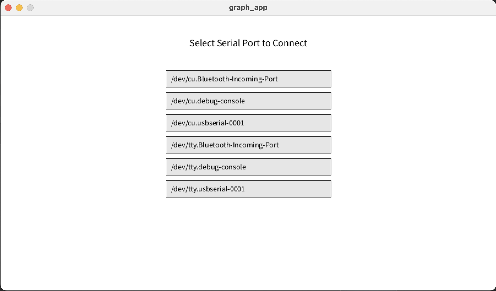

# vl53l4cd_experiment_delphine

Repository containing the Arduino code running on an ESP32 driving a VL53L4CD ToF sensor and a small Processing app to display data

## Installation

1. Go to [esp32-macos-driver](https://www.silabs.com/developer-tools/usb-to-uart-bridge-vcp-drivers) and install the correct version based on your computer's architecture. The installation will error out after ~10m. This is normal. Just close it after it's done. You should see the driver installed in the Applications folder.
2. Go to the release page, select the latest version (1.0.0 at this moment)
3. Connect the ESP32 to your computer. When properly connected, you should see a red LED on the board and the sensor will have a green LED lighting up.
4. Go to the folder containing the app with the right architecture for your computer. Double click on it. It will open the app.
5. When the app has started, you'll be welcome with the following screen:
   You'll need to select the right port to start receiving data. Normally, it should be /dev/cu.usbserial-0001. Click on it and happy test!

## Assistance

In case of problems, just contact your favorite older brother and he'll be more than pleased to assist you! ;)
